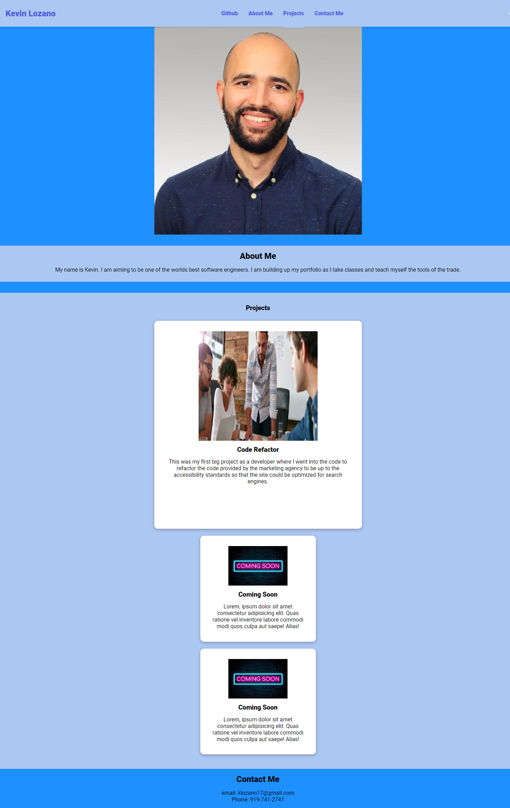

# Lozano-Portfolio
My portfolio

## Description

I wanted to build a portfolio to be able to showcase my work to the world and to future employers. Also, it is a great way to keep tabs of my previous works that I am proud to show off. I learned a lot of different aspects of HTML and CSS that I was not aware of.

## Usage

Link to my portfolio: https://klozano17.github.io/Lozano-Portfolio/

-
